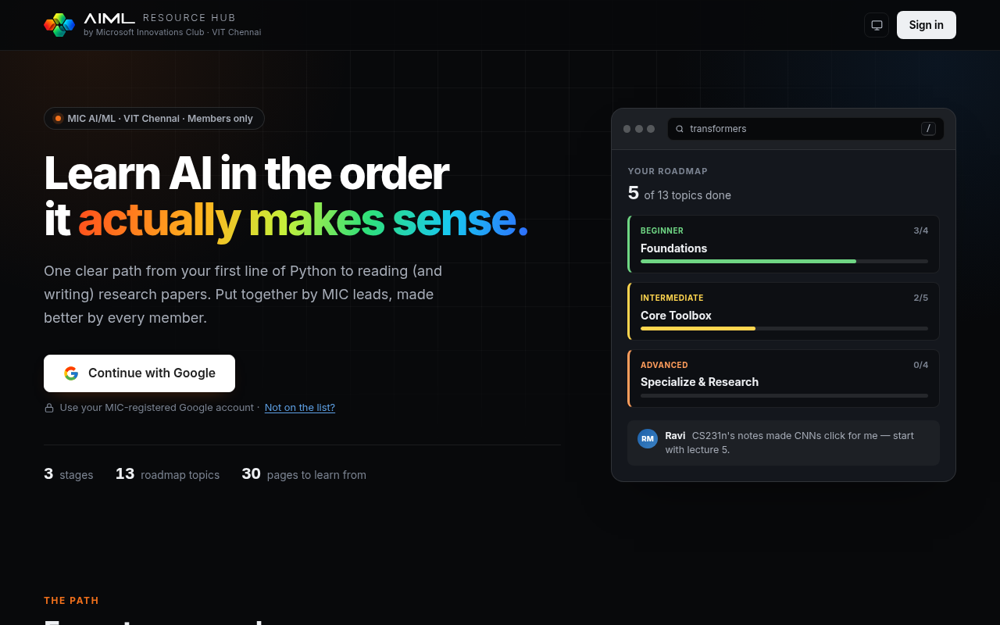
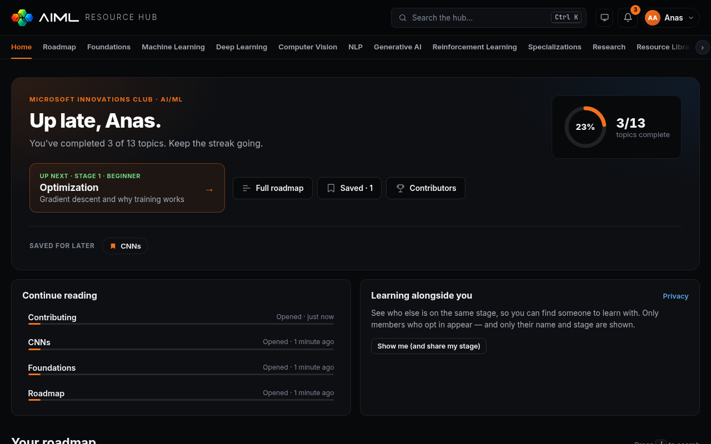
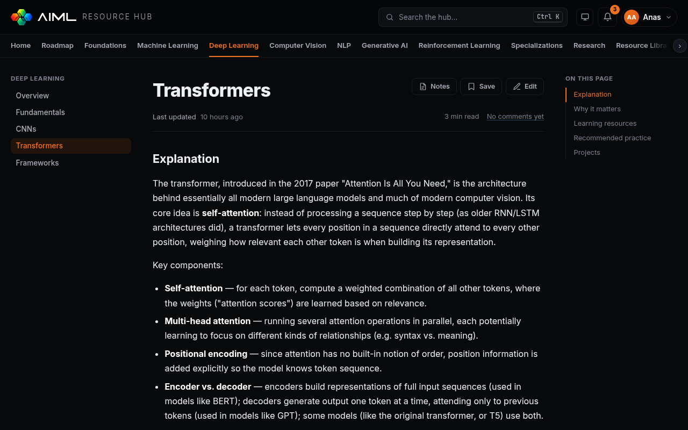
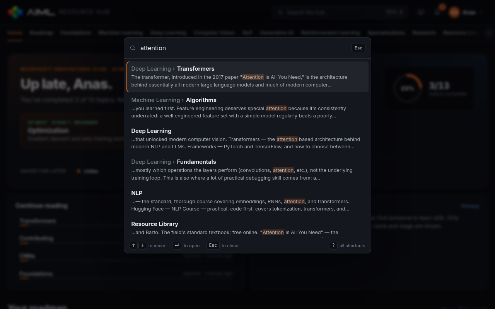
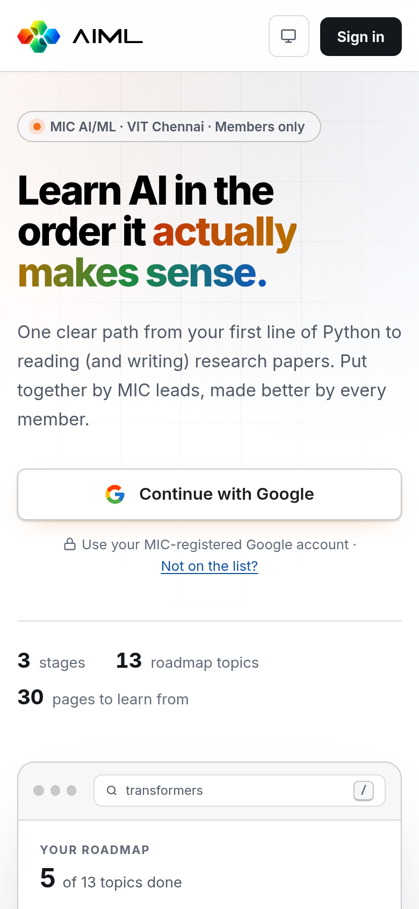
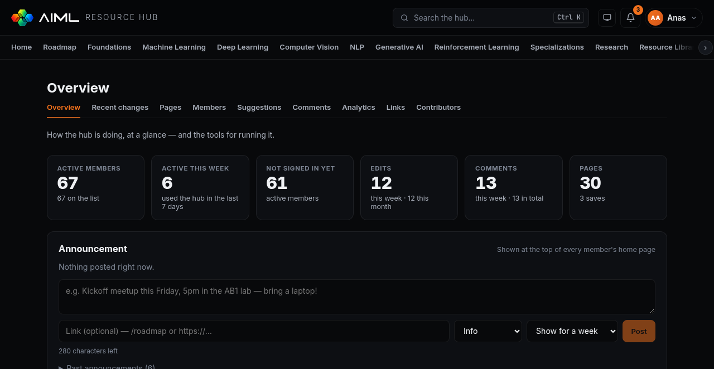

<div align="center">


# AIML Resource Hub

**Microsoft Innovations Club (MIC) · VIT Chennai**

One maintained path to learn AI, from your first line of Python to reading and writing research papers.<br />
Members-only, edited wiki-style by the whole club.

[**Open the hub →**](https://mic-aiml-resource-hub.onrender.com)



</div>

---

## Contents

- [What it does](#what-it-does)
- [Roles and permissions](#roles-and-permissions)
- [How it's built](#how-its-built)
- [Running it locally](#running-it-locally)
- [Managing members](#managing-members)
- [Deploying](#deploying)
- [Security notes](#security-notes)
- [Contributing](#contributing)

## What it does

### For every member

| | |
|---|---|
| **A learning roadmap** | Three stages and their topics in order. Tick topics off as you go; progress is saved to your account, so it follows you to any device. The home page shows what's **up next**. |
| **Continue reading** | The home page lists the pages you read last and how far through you got; reopening one offers to jump back to where you stopped. |
| **Streaks and badges** | Weekly streaks (miss a day, keep the streak) and ten milestones, on your profile at `/me`. |
| **Learning alongside you** | Opt in to see who else is on the same stage — name and stage only, never without consent. |
| **Search** | Press <kbd>/</kbd> or <kbd>Ctrl</kbd> <kbd>K</kbd> anywhere to search every page's title and text. |
| **Notifications** | A bell for replies to your comments, updates to pages you saved, announcements, and how your suggested edits went. |
| **Private notes** | Notes on any page, saved as you type, visible only to you; all of them at `/notes`. |
| **"Helped me"** | 👍 on any resource link, so the best course or video for a topic surfaces. |
| **Wiki editing** | Any member can edit any page: publish straight away or **send for review** first. Split write/preview, paste or drop images in, <kbd>Ctrl</kbd> <kbd>S</kbd> to save, and a refusal (not a silent overwrite) if someone else saved while you were editing. |
| **Help wanted** | Flag a page as out of date, incomplete or broken; flagged pages collect at `/help-wanted` for contributors to pick up. |
| **Discussion** | A comment thread with replies under every page. Comments support a safe subset of Markdown. |
| **Saved pages** | Bookmark pages to come back to; they show on your home page and at `/saved`. |
| **Contributors board** | Ranks members by words written, not by how often they hit save. |
| **Reading extras** | Reading time, a copy button on code, a link to any section, and a clean print / save-as-PDF layout. |
| **Install and offline** | Install the hub as an app on a phone or laptop; pages you've opened stay readable without a connection. |
| **Keyboard shortcuts** | Press <kbd>?</kbd> for the list — <kbd>g</kbd> <kbd>r</kbd> for the roadmap, <kbd>e</kbd> to edit, <kbd>b</kbd> to save a page, and more. |
| **Light and dark themes** | Follows your system by default; the toggle in the header overrides it. |

<table>
  <tr>
    <td></td>
    <td></td>
  </tr>
  <tr>
    <td align="center"><sub>Home: progress, what's next, saved pages</sub></td>
    <td align="center"><sub>A topic page with its "On this page" contents</sub></td>
  </tr>
  <tr>
    <td></td>
    <td align="center"></td>
  </tr>
  <tr>
    <td align="center"><sub>Search across every page</sub></td>
    <td align="center"><sub>Works on phones too</sub></td>
  </tr>
</table>

### For admins and leads

Everything lives under the account menu → **Admin**.

<p align="center"></p>

| Screen | What it's for |
|---|---|
| **Overview** `/admin/overview` | Members, weekly activity, edits and comments at a glance. Lists who **hasn't signed in yet**, with one click to copy their emails for a reminder. Shows the most-discussed and most-saved pages, and the **admin activity log**. |
| **Announcements** (on Overview) | Post a notice that appears at the top of every member's home page, with an optional link and an expiry. Members can dismiss it; a new one always shows. |
| **Recent changes** `/admin` | Every edit across the hub, with diffs and one-click restore. |
| **Pages** `/admin/pages` | Create, reorder, hide or delete pages and place them on the roadmap. Deleting a page that others link to asks first and names the links that would break. |
| **Members** `/admin/members` | Add members one at a time or in bulk, filter by *not signed in* / *active this week* / *deactivated*, see when each person was last active, change roles, deactivate, and export the list as CSV. |
| **Suggestions** `/admin/suggestions` | Edits members sent for review, each with a diff and a warning if the page changed since. Approving publishes it under the author's name; they're notified either way. |
| **Comments** `/admin/comments` | The latest comments from every page in one feed, with delete. |
| **Analytics** `/admin/analytics` | Readers per day, most-read and never-opened pages, and a roadmap funnel showing where members stop. |
| **Link checker** `/admin/links` | Checks every external link in the hub and lists the dead ones with the pages they're on. Runs weekly once scheduled. |
| **Access requests** (on Members) | People not on the list can ask to join from the landing page; approve or decline in one click. |
| **Reminder emails** (on Overview) | A friendly nudge to members quiet for two weeks — at most one per person per fortnight, and members can turn them off. Needs email set up (below). |

Every administrative action (role changes, deactivations, removals, page deletions, restores, comment removals, announcements, exports) is written to an **audit log** shown on the Overview, so leads can always see who did what.

## Roles and permissions

Three ranks. Every check compares ranks, so the rule is always *you can act on someone you outrank*.

| | Member | Admin | Lead |
|---|:---:|:---:|:---:|
| Read, search, comment, save pages | ✅ | ✅ | ✅ |
| **Edit any page** (publishes immediately) | ✅ | ✅ | ✅ |
| See history and the contributors board | ✅ | ✅ | ✅ |
| Restore an earlier version of a page | — | ✅ | ✅ |
| Create, reorder, hide, delete pages | — | ✅ | ✅ |
| Add and deactivate members, export the list | — | ✅ | ✅ |
| Post announcements, moderate comments, see the audit log | — | ✅ | ✅ |
| Promote or demote an **admin** | — | — | ✅ |
| Appoint or remove a **lead** | — | — | ✅ |
| **Permanently remove** a member | — | — | ✅ |

`admin` is meant for sub-leads and volunteers; `superadmin` (shown as **Lead** in the app) is for the board.

- **Admins can't manage each other or create admins.** Equal ranks don't outrank, so delegating access can never lock the board out.
- **Leads can manage each other**, so a board handover happens entirely in the app.
- **Two guards prevent lock-out:** nobody can demote, deactivate or remove themselves, and the last active lead can't be removed.

### How access works

There's no public sign-up. A Google account can sign in **only if its email is on the member list**, and that list is the only access check, so a personal Gmail works if a lead adds it.

The list is re-checked on **every request**, not just at sign-in. Adding, deactivating or removing someone takes effect on their next page load, with no redeploy.

## How it's built

| Part | Tech |
|---|---|
| `client/` | React 19 + Vite, React Router, react-markdown. No UI framework; one token-based stylesheet set with light and dark themes. |
| `server/` | Express, Passport (Google OAuth 2.0), Mongoose, Helmet, express-rate-limit. |
| Database | MongoDB Atlas: members, pages, revisions, comments, bookmarks, announcements, audit log. |

In production the Express server also serves the built React app, so the site and the API share one origin and the session cookie stays first-party.

<details>
<summary><strong>Design notes</strong></summary>

- **Structure is data, not code.** The nav and roadmap are derived from the pages themselves: a page's `section` and `order` place it in the nav, and an optional `roadmapStage` puts it on the roadmap. There's no separate nav table to fall out of sync.
- **Contributions are measured, not counted.** Each save is diffed against the previous version (line-level LCS) and the word and line counts are stored on the revision, so the leaderboard is a cheap aggregation. The original Markdown import, blank-line reformatting and restores don't count. Restoring someone's words credits them once, not again.
- **Bylines follow people.** "Last edited by" looks the editor up live, so it shows their current name and falls back to their email if they've left.
- **Progress follows the account.** Roadmap ticks are stored per member and cached in the browser, so the roadmap paints instantly and works offline; ticks made before this existed are merged in once, and merging only ever adds.
- **Images live in the database.** Uploads are capped at 1.5 MB and checked by their actual bytes (PNG, JPEG, GIF, WebP — never SVG), so the hub needs no separate file storage.
- **The link checker can't be aimed inward.** Every hop, redirects included, is resolved first and private or internal addresses are refused.
- **Small bundles.** Each screen is its own chunk, so a member reading a page never downloads the admin tools.

</details>

<details>
<summary><strong>Project layout</strong></summary>

```
client/
  src/pages/        one file per screen (Home, ContentPage, EditPage, OverviewPage, …)
  src/components/   header, search palette, comments, roadmap, admin frame, …
  src/hooks/        shared roadmap progress, document titles
  src/styles/       theme tokens + per-area stylesheets
  src/content/      the original Markdown, used only to seed a new database
server/
  src/routes/       auth, pages, members, structure, stats, library (search + bookmarks), comments,
                    me (progress, reading, notes, profile, notifications), community (ratings,
                    flags, suggestions, access requests), media (images), ops (analytics, links,
                    reminders, scheduled jobs), admin
  src/models/       Member, Page, Revision, Comment, Bookmark, Note, Progress, ReadingHistory,
                    PageView, Notification, Rating, PageFlag, Suggestion, AccessRequest,
                    Image, LinkCheck, Announcement, AuditLog, RoadmapStage
  scripts/          seeding and member-management tools (see below)
docs/screenshots/   images used in this README
```

</details>

## Running it locally

Needs **Node 18+** and a MongoDB database.

```bash
# 1. Install
npm install --prefix server
npm install --prefix client

# 2. Configure
cp server/.env.example server/.env
cp client/.env.example client/.env
```

### Option A: no Google or Atlas account needed

Run MongoDB in a container and use the built-in development sign-in:

```bash
docker run -d --name aihub-mongo -p 27017:27017 mongo:7      # or: podman run …
```

In `server/.env`:

```bash
MONGODB_URI=mongodb://127.0.0.1:27017/ai-hub
GOOGLE_CLIENT_ID=placeholder
GOOGLE_CLIENT_SECRET=placeholder
NODE_ENV=development
DEV_LOGIN=1
```

`DEV_LOGIN` adds `/auth/dev-login?email=…`, which signs you in as any active member without Google. It only exists when **both** `NODE_ENV=development` and `DEV_LOGIN=1` are set, so it can't appear in production.

### Option B: real Google sign-in

Fill `server/.env` with an Atlas connection string and a Google OAuth client, and add `http://localhost:4000/auth/google/callback` to the client's authorised redirect URIs.

> ⚠️ `server/.env` points at whatever database you give it. If that's the production cluster, local testing writes to live data.

### Seed and start

```bash
cd server
node scripts/seedPages.js                              # the pages, from client/src/content
node scripts/seedStructure.js                          # nav order + roadmap stages
printf 'name,email\nYour Name,you@example.com\n' > members.csv
npm run import-members -- members.csv
node scripts/setRole.js you@example.com superadmin     # the first lead
```

The first lead has to be made from the terminal, because changing a lead is itself lead-only. Then run each half in its own terminal:

```bash
cd server && npm run dev     # API on :4000
cd client && npm run dev     # app on :5173
```

Open http://localhost:5173 (with Option A, visit `http://localhost:4000/auth/dev-login?email=you@example.com` first).

## Managing members

The **Members** screen covers day-to-day work. These scripts are for bootstrapping and bulk changes, and run against whatever `MONGODB_URI` points at:

```bash
cd server

node scripts/setRole.js                                  # list everyone above "member"
node scripts/setRole.js <email> <member|admin|superadmin>

npm run import-members -- members.csv                    # add/update from a CSV (name,email)
node scripts/resetMembers.js members.csv                 # preview: replace everyone except leads
node scripts/resetMembers.js members.csv --write         # …and apply it

node scripts/backfillStats.js --write                    # recompute contribution stats
node scripts/excludeFromStats.js <email> --write         # keep test edits off the board
node scripts/excludeFromStats.js <email> --undo --write  # put them back
```

Scripts that change data preview first and only apply with `--write`. `resetMembers.js` never touches leads, so it can't lock you out. **`members.csv` is git-ignored**: a roster is personal data and this repo is public.

## Deploying

The live hub runs on **Render** as a Web Service connected to this repo, and redeploys on every push to `main`.

| Setting | Value |
|---|---|
| Build command | `npm install --prefix client --include=dev && npm run build --prefix client && npm install --prefix server` |
| Start command | `node server/src/index.js` |
| Health check path | `/api/health` |

`--include=dev` is needed because `NODE_ENV=production` would otherwise skip the dev dependencies Vite builds with.

| Environment variable | Value |
|---|---|
| `NODE_ENV` | `production` |
| `MONGODB_URI` | Atlas connection string, with the database name: `…mongodb.net/ai-hub?…` |
| `GOOGLE_CLIENT_ID` / `GOOGLE_CLIENT_SECRET` | From Google Cloud Console → Credentials |
| `SESSION_SECRET` | A long random string: `node -e "console.log(require('crypto').randomBytes(32).toString('hex'))"` |
| `SERVER_URL` and `CLIENT_URL` | Both the site's own URL, no trailing slash |

Don't set `DEV_LOGIN` or `VITE_API_URL` in production.

**Optional — email** (reminders, and a welcome email when an access request is approved). Without these the hub works the same and says email isn't set up:

| Environment variable | Value |
|---|---|
| `SMTP_HOST` / `SMTP_PORT` | e.g. `smtp.gmail.com` / `465` |
| `SMTP_USER` / `SMTP_PASS` | The sending account; for Gmail, an **App Password** (Google Account → Security → App passwords), not the real password |
| `MAIL_FROM` | e.g. `MIC AI/ML Hub <you@gmail.com>` |

**Optional — weekly jobs** (reminder emails and the link check). Render's free tier sleeps, so a GitHub Actions schedule ([`.github/workflows/weekly.yml`](.github/workflows/weekly.yml)) wakes the site every Monday and asks it to run them:

1. In Render, add `CRON_SECRET` — any long random string.
2. In GitHub → Settings → Secrets and variables → Actions, add `SITE_URL` (the site's address) and the same `CRON_SECRET`.

Until both are set, the workflow skips itself and the endpoint doesn't exist.

> ⚠️ Keep `server/.env` pointed at a **local** database for development. To run a script against the real database, set it for that one command instead — `MONGODB_URI='…' node scripts/…` — so nothing else picks it up, and never combine the real database with `DEV_LOGIN`.

Two things outside Render have to be set up too:

1. **Atlas → Network Access:** allow `0.0.0.0/0`. Render has no fixed outbound IP, and without this the server can't reach the database and exits on start.
2. **Google Cloud → Credentials → your OAuth client:** add `<site URL>/auth/google/callback` under *Authorized redirect URIs*.

Adding or removing members is a database change, not a code change, so it never needs a deploy.

## Security notes

- **Headers:** Helmet sets a strict Content-Security-Policy (scripts only from the site itself), HSTS, and frame protection.
- **Rate limits** are per member, not per IP, because a whole campus can share one address. Writes have a tighter budget than reads.
- **Input checks:** page slugs are validated as plain strings everywhere, so query-string objects can't become database operators. Announcement links must be `https://` or in-app. The CSV export neutralises spreadsheet formulas.
- **`SESSION_SECRET` is a password.** Anyone with it can forge a signed-in session. Never commit or screenshot it, and rotate it if it leaks (that signs everyone out once). The same goes for the Atlas password and the Google client secret.
- **Never commit `.env` or `members.csv`.** Both are git-ignored.

## Contributing

**Content:** open any page on the site and hit **Edit**. Changes go live immediately and every save is versioned, so a lead can restore an earlier version if needed. Found a problem you'd rather not fix yourself? Open a [content issue](../../issues/new?template=content-issue.md) or [suggest a resource](../../issues/new?template=resource-suggestion.md).

**Code:** open a pull request. Before you do:

```bash
npm run lint --prefix client     # oxlint, should report nothing
npm run build --prefix client    # must build cleanly
```

## License

Content is shared for educational use by the MIC VIT Chennai community. No open-source license has been chosen for the code yet; add a `LICENSE` file (for example MIT for code, CC BY 4.0 for content) if the club decides on one.
